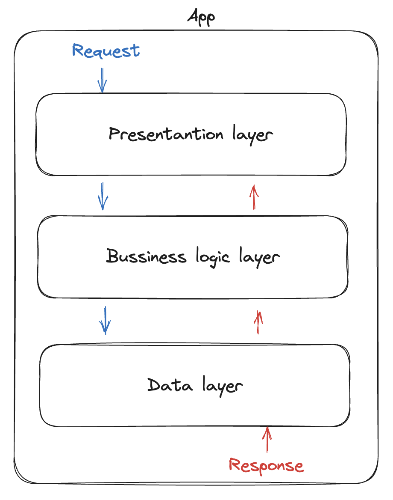

# 🧪 Código testável

Primeiramente, na minha opinião, uma forma de organizar o código não significa arquitetura, por mais que muitas tenham architecture no nome. Então, tudo que eu vou falar nesse documento se diz a maneiras de organizar o código, que facilitam a criação de testes no contexto de uma API backend, sejam eles de integração ou unitários.

### Estrutura do código

Para a organização de código, o mais comum é usarmos Layered Architecture, que é nada mais do que dividir o código em camadas que representem algum significado para a aplicação, como por exemplo, cada camada ter uma responsabilidade específica para o funcionamento da aplicação. Veja o exemplo da imagem abaixo.

<figure><figcaption><p>Exemplo simplificado de uma arquitetura de camadas</p></figcaption></figure>

A "presentation layer" é responsável por exibir o conteúdo da aplicação ao usuário, a "bussiness logic layer" é responsável por garantir que as regras de negócio estejam sendo aplicadas para os dados recebidos ou solicitados, e a "data layer" é responsável por armazenar corretamente esses dados.

#### Service  Pattern

O pattern de service serve para uma aplicação multicamada utilizando a layered architecture.

E o service é uma abstração da bussiness logic layer, uma camada da aplicação onde ocorre os tratamentos e garante que operações obedeçam regras estabelecidas pela área de negócio. Um exemplo de uma regra é que não deve ser possível ter múltiplos cadastros na nossa aplicação com o mesmo endereço de email.

Para fazer o tratamento da regra acima precisaríamos verificar, durante a criação de um usuário, se aquele e-mail já não existe em um cadastro ativo na nossa base de dados e, caso exista, retornar para a camada acima da nossa aplicação um erro, informando o que deu errado na nossa transação.&#x20;

#### Repository Pattern

Assim como o service, o repository também é uma abstração, só que da camada de acesso aos dados. A camada de repository é responsável por fazer a conexão com o armazenamento de dados da aplicação e salvar ou retornar os dados solicitados.

### O problema

A layered architecture em si não é um problema, e sim a forma como organizamos o nosso código dentro das funções nas camadas. O ponto chave para o teste em uma API é a camada de services, pois é nela onde ficam as regras, onde está mais propício a erros e onde acabam se concentrando a maior partes dos nossos testes.

Digamos que na nossa aplicação um usuário deve ser maior de 18 anos, seu username não pode ser maior do que 5 caracteres e deve ter um email válido e e não existente de outro usuário.

<pre class="language-python"><code class="lang-python"><strong>#Service 1
</strong><strong>def create_user(username: str, email: str, age: int):
</strong><strong>    '''Service para a criação de um usuário'''
</strong><strong>    if age &#x3C; 18:
</strong><strong>        raises print('O usuário deve ter 18 anos ou mais!')
</strong><strong>    if len(username) > 5:
</strong>        raises print('O nome de usuário não pode conter mais do que 5 caracteres!')
    if validate_email(email) is False:
        raises print('O email deve ser válido!')
    user_with_email = repository.get_user_by_email(email)
    if user_with_email is True:
        raises print('Email já cadastrado!')
    
    #Se nada deu erro, então vamos ao cadastro do usuário 😅
    return repository.create_user(username: str, email: str, age: int)
</code></pre>

Pronto! Service criado e respeitando todas as regras de negócio. Trabalho concluído com sucesso, né? Bom...&#x20;

E se eu quiser testar apenas a criação de um usuário considerando que ele atende a todas as regras de negócio? Ou se eu quiser forçar algum erro específico? Agora imagine responder a essas perguntas em um service bem mais complexo e muitas condições que se repetem diversas vezes na sua aplicação... Complicou, né? Vamos ao exemplo 2.

```python
def handler_check_if_there_is_user_with_email(email: str):
    '''Raises error if no user with corresponding email is found'''
    user_with_email = repository.get_user_by_email(email)
        if user_with_email is True:
            raises print('Email já cadastrado!')
    return None

def handler_validate_email(email: str):
    '''Raises error if email is invalid'''
    if validate_email(email) is False:
            raises print('O email deve ser válido!')
    return True

#Service 2
def create_user(username: str, email: str, age: int):
    '''Service para a criação de um usuário'''
    def validate():
        if age < 18:
            raises print('O usuário deve ter 18 anos ou mais!')
        if len(username) > 5:
            raises print('O nome de usuário não pode conter mais do que 5 caracteres!')
        handler_validate_email(email)
        handler_check_if_there_is_user_with_email(email)
    
    validate()
    #Se nada deu erro, então vamos ao cadastro do usuário 😅
    return repository.create_user(username: str, email: str, age: int)        
```

Os dois exemplos acima são de services que fazem exatamente o mesmo trabalho, a diferença principal é que no Service 1 todo o código está dentro do service em si. Já no service 2 está implementado com um conceito que eu gosto de utilizar que chamo de "handlers". Handlers são funções com uma implementação bem específica com o objetivo de validar uma única situação, além disso, toda a implementação de regras está dentro de uma função chamada validate.

A implementação do service 2 facilita os testes unitários por que está implementado de uma maneira que me dá mais pontos de acessos nos testes para realização de mocks, de tal forma que, se eu quiser testar apenas a criação de um usuário, considerando que todas as regras estejam validadas, basta eu mockar o validate. E caso eu queira forçar algum erro específico eu também consigo através das constantes ou mockando o retorno das funções de handler se forem trechos de código que já estejam cobertos por testes.
